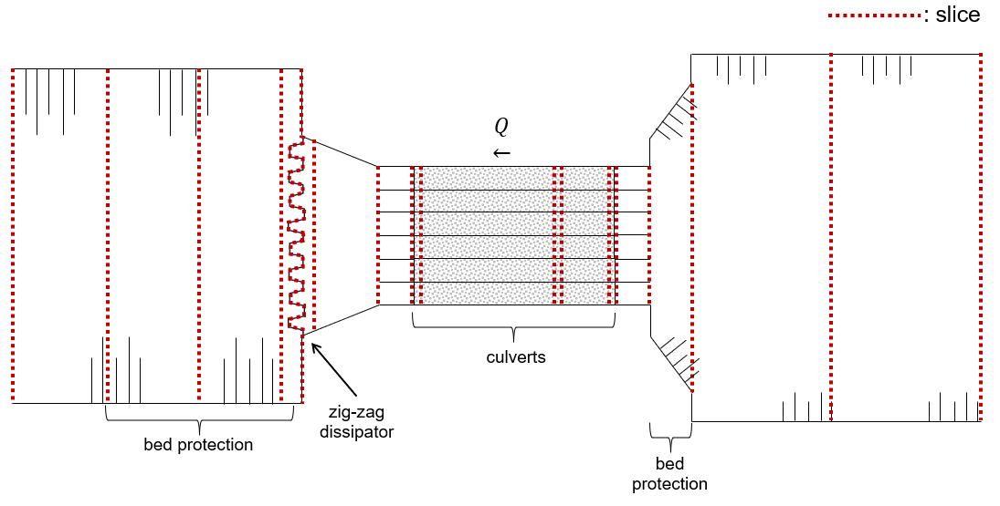

.. |br| raw:: html

    

.. _examples:

Example: Bathse Spuisluis
===========

This example demonstrates the results of SPUIS4.02 by applying it to an as-built discharge sluice that is part of the Dutch Deltaworks: discharge sluice Bath (Dutch: ‘Bathse Spuisluis’). This discharge sluice is located at the end of a flushing channel (Dutch: ‘Bathse Spuikanaal’) between Lake Volkerak-Zoom and the Western Scheldt. It discharges surplus fresh water from the lake into the Western Scheldt to regulate Lake Volkerak-Zoom’s water level and to improve its water quality (flushing). The discharge sluice consists of six concrete culverts and has a maximum discharge capacity of 300 m³/s. A zigzag shaped energy dissipator (:math:`\mu` = 0.7, see `Tutorial <https://spuis.readthedocs.io/en/latest/tutorial.html>`_) is located at the end of the outflow channel. A schematic top view of discharge sluice Bath is shown below. Areas shaded in grey have a ceiling.

.. image:: ../images/schematisatie_Bath.png

To capture the geometry of discharge sluice Bath [1]_ [2]_ and flushing channel [3]_, seventeen slices were defined. The `Tutorial <https://spuis.readthedocs.io/en/latest/tutorial.html>`_ page explains how this schematization was set up using a few of the profiles as an example.

The result of schematizing discharge sluice Bath in SPUIS4.02 is shown below (black lines) for several configurations (meaning combinations of open/closed gates). The applied calculation method is ``1`` (Bernoulli and momentum equations). Shown along with the results are a set of field measurements (+) from 1988 [4]_ and calibrated calculations (o) used by Rijkswaterstaat (Directorate-General of the Ministry of Infrastructure and Water Management of the Netherlands) in their operational water management [5]_. The configuration of each culvert is denoted by “O” for fully opened and “X” for closed. The SPUIS schematization shows good agreement with the field measurements and calibrated calculations.

.. image:: ../images/resultaat_Bath.png

The input file for the schematization of one of Bathse Spuisluis' culverts is shown below (corresponding to orange in the figure above). To extend this example to other possible configurations with more than one culvert in operation, the width and wetted perimeter of all profiles located in the culverts need to be extended.

.. literalinclude:: ../input/bath.in
   :language: none

Literature
----------
.. [1] WL | Delft Hydraulics (1982). ‘Lozingsmiddel Zoommeer. Verifikatie en aanpassing ontwerp, bepaling afvoerkarakteristieken en rekenmodel spuisluis met vrije waterspiegel.’ Report M1711/R1372.
.. [2] Rijkswaterstaat Directie Zeeland (1988) – Ontwerpnota compartimentswerken, deelnota 8: Bathse Spuisluis nota z.bc. 88-20.004
.. [3] Rijkswaterstaat Directie Zeeland (1988) – Ontwerpnota compartimentswerken, deelnota 3: Bathse Spuikanaal nota z.bc. 88-20.007
.. [4] Rijkswaterstaat (1988). 'Meetresultaten debietmeting Bathse Spuisluis - 17 t/m 23 juni 1988.'
.. [5] Landelijk Meetnet Water (LMW): `Rijkswaterstaat Waterinfo <https://waterinfo.rws.nl/#/publiek/waterafvoer>`_
