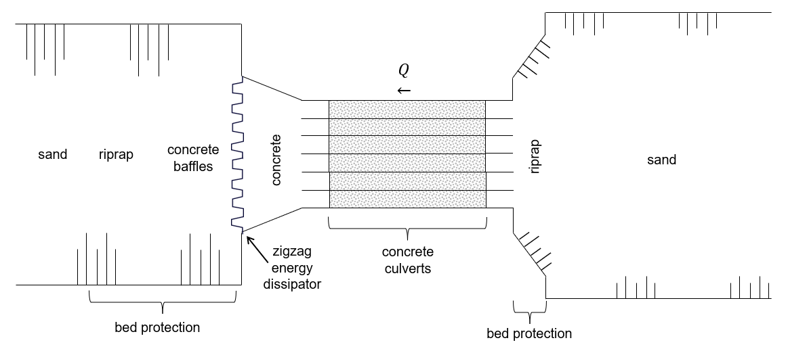
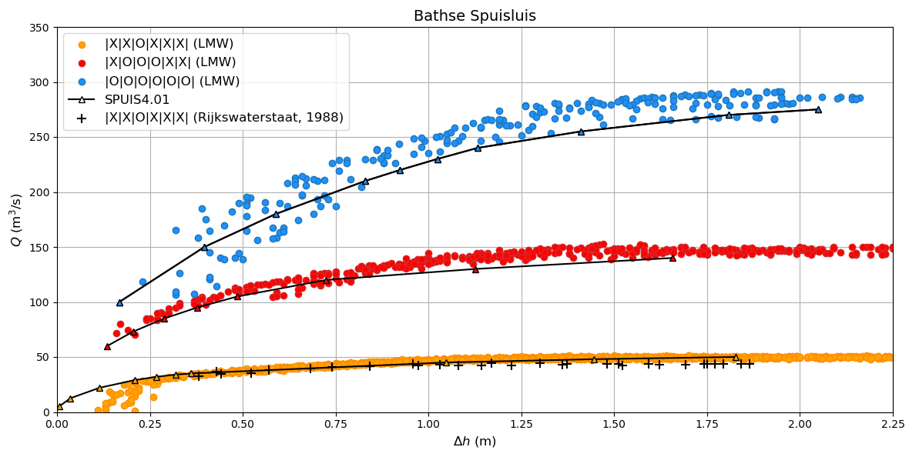

.. |br| raw:: html

    

.. _examples:

Example: Bathse Spuisluis
===========

This example demonstrates the capabilities of SPUIS4.01 by applying it to an as-built discharge sluice that is part of the Dutch Deltaworks: discharge sluice Bath (Dutch: ‘Bathse Spuisluis’). This discharge sluice is located at the end of a flushing channel (Dutch: ‘Bathse Spuikanaal’) between Lake Volkerak-Zoom and the Western Scheldt. It discharges surplus fresh water from the lake into the Western Scheldt to regulate Lake Volkerak-Zoom’s water level and to improve its water quality (flushing). The discharge sluice consists of six concrete culverts and has a maximum discharge capacity of 300 m³/s. A zigzag shaped energy dissipator is located at the end of the outflow channel. A schematic top view of discharge sluice Bath is shown below.

The result of schematizing discharge sluice Bath in SPUIS4.01 is shown below (black lines) for several configurations (meaning combinations of open/closed gates). Shown along with the results are a set of field measurements (+) from 1988 [1] and calibrated calculations (o) used by Rijkswaterstaat (Directorate-General of the Ministry of Infrastructure and Water Management of the Netherlands) in their operational water management [2]. The configuration of each culvert is denoted by “O” for fully opened and “X” for closed. The Bernoulli and momentum equation method was applied in these simulations. The SPUIS schematization shows good agreement with the field measurements and calibrated calculations.

The input file for the schematization of one of Bathse Spuisluis' culverts is shown below. To create schematizations for other culvert configurations, the wet perimeter of every profile that describes part of the discharge sluice should be adjusted.

.. literalinclude:: ../input/bath.in
   :language: none

Literature
----------

[1] Rijkswaterstaat (1988). 'Meetresultaten debietmeting Bathse Spuisluis - 17 t/m 23 juni 1988.'
[2] `Rijkswaterstaat Waterinfo <https://waterinfo.rws.nl/#/publiek/waterafvoer>`_
