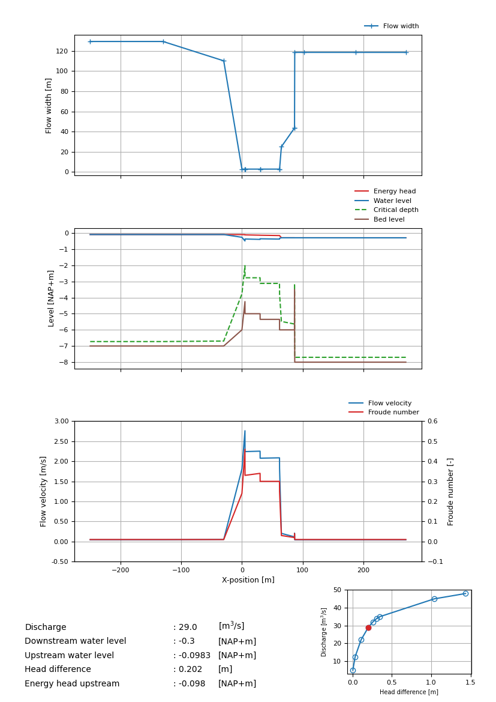

.. _installatie:

Getting Started
===========

.. _pythonpakket:

Requirements
--------------------------
Typical end-users will use the function :py:func:`runSpuis` to run a SPUIS simulation. Some additional Python libraries are required to run this script. You can install the required libraries with the following command:

.. code-block:: console

   pip3 install ./docs/requirements.txt

Running a simulation
--------------------------
Upon running :py:func:`runSpuis`, you will be prompted with two questions:

.. code-block:: console

   Save figures? [Y/N]

where ``Y`` will save all figures to the input folder directly, and ``N`` will show the figures on your screen without saving them.

.. code-block:: console

   Use a single input file? Alternative is selecting a folder containing input files [Y/N] 

where ``Y`` will open up your file explorer and allow you to choose a single input (``.in``) file, and ``N`` will allow you to select a folder with multiple input files that will then run consecutively.

Three output files with raw data will be generated:

* ``.uin``: Repeats the input (restructured from ``.in`` file), followed by detailed information about each run (i.e. each set of a simulated discharge and downstream water level): x-location, water levels, bed levels, energy heights, Froude numbers, critical depth, velocity, wetted perimeter and flow regime.
* ``.uws``: Contains detailed information about each run: x-location, water levels, bed levels, energy heights, Froude numbers, critical depth, velocity, wetted perimeter and flow regime.
* ``.uqh``: A short summary with only water levels, head differences, discharge and flow regime per run.

The ``.uws`` file is used to automatically generate 4 subfigures for each run. An example of such a figure is shown below for the fourth run in a series of nine runs. The details of the fourth run (discharge, water levels, head difference and energy height) are shown in the bottom left corner. The figure of the discharge relationship in the bottom right corner shows the result for all nine runs and highlights the current run (red dot) on which the other subfigures are based.

After the calculations are finished, a final prompt will request the cross-sectional area of the discharge sluice:

.. code-block:: console

   Sluice-gate opening area? [float]

This value is then used to generate two additional figures: the discharge coefficient :math:`\mu` as a function of discharge :math:`Q` and as a function of head difference :math:`\Delta h`, determined using

.. math::
    :label: afvoerrelatie

    Q = \mu A \sqrt{2 g \Delta h} 

where :math:`A` is the provided cross-sectional area of the discharge sluice and :math:`g` is the acceleration due to gravity.
