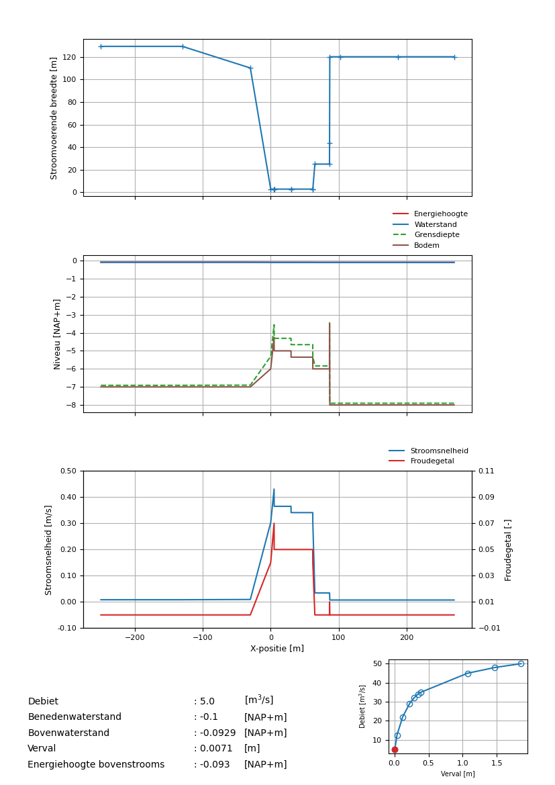

.. _installatie:

Getting Started
===========

.. _pythonpakket:

Requirements
--------------------------
Typical end-users will use the function :py:func:`runSpuis` to run a SPUIS simulation. Some additional Python libraries are required to run this script. You can install the required libraries with the following command:

.. code-block:: console

   pip3 install ./docs/requirements.txt

Running a simulation
--------------------------
Upon running :py:func:`runSpuis`, you will be prompted with two questions:

.. code-block:: console

   Save figures? [Y/N]

where Y will save all figures to the input folder directly, and N will show the figures on your screen without saving them.

.. code-block:: console

   Use a single input file? Alternative is selecting a folder containing input files [Y/N] 

where Y will open up your file explorer and allow you to choose a single input (.in) file, and N will allow you to select a folder with multiple input files that will then run consecutively.

Three output files with raw data will be generated. Files with extension .uin repeat the input (restructured from .in file), followed by detailed information about each run: x-location, water levels, bed levels, energy heights, Froude numbers, boundary layer depth, velocity, wet perimeter and flow regime. Files with extension .uws show only the latter part with detailed information about each run, and .uqh files show a short summary with only water levels (and head differences), discharge and flow regime.

The .uws files with detailed information are used to generate 4 subfigures for each run with some additional details of the in- and output of the simulation. An example of such a figure is shown below.

