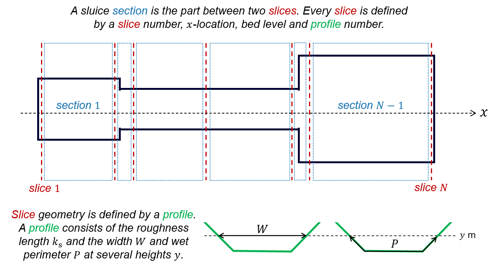
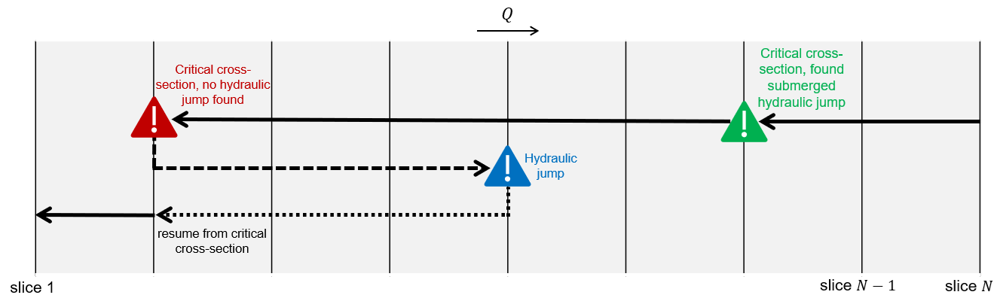

.. |br| raw:: html

    

.. _theory:

Theory
===========

SPUIS calculates water levels, energy heights, (average) flow velocities and Froude numbers in discharge sluices and other hydraulic structures with a free surface or with submerged pipes or culverts. The hydraulic structure may contain control structures such as gates, spillways or valves. Constructions up- and downstream of the hydraulic structure, such as a gradually varying discharge channel with sheet pile walls at the sides for guiding the flow, or an energy dissipator at the downstream end, can also be taken into account. The input (boundary) conditions for a SPUIS calculation are a combination of a discharge and a downstream water level. A minimum of 1 and maximum of 100 of these discharge and water levels pairs (referred to as 'runs') can be performed in a single simulation. After completion of a simulation, the cross-sectional area :math:`A` of the discharge sluice must be specified (through a prompt in the Python terminal, see `Getting Started <https://spuis.readthedocs.io/en/latest/getting-started.html>`_) such that the discharge coefficient :math:`\mu` can be determined through :math:`Q = \mu A \sqrt{2 g \Delta h}`.

To run calculations with SPUIS, the hydraulic structure must be schematized by defining at least 2 and at most 50 slices (red in the figure below). The bed level and location (:math:`x`-direction) along the waterway needs to be specified for each slice. If two consecutive slices have a different bed level, the bed level of the section (blue in the figure below) in-between the slices will increase or decrease linearly to create a sloping bed. Slices should be chosen such that all changes in the width and height of the hydraulic structure and surrounding waterway are captured. The geometry of each slice is defined by a profile (green in the figure below) with a Nikuradze roughness length :math:`k_s`, and widths :math:`W` and wetted perimeters :math:`P` specified at several (at least 2 but at most 20) heights (:math:`y`-direction). A single profile may be used to describe multiple slices that have the same geometry, but if the roughness differs a new profile must be defined for that slice. Profiles describing parallel culverts must describe these culverts as a single, larger culvert: separation into individual parallel culverts is not possible in SPUIS. To ensure that (wall) friction losses are calculated correctly in this case, the wetted perimeter of this single, larger culvert needs to be equal to the sum of the wetted perimeters of each individual culvert, i.e. including the length of the partition walls. Additional hydraulic losses due to in- and outlet shape or the presence of rebates or other irregularities at a slice location are taken into account in the profile definition by multiplying the wetted perimeter with a contraction coefficient :math:`\xi` (for tips on determining :math:`\xi`, see `Tutorial <https://spuis.readthedocs.io/en/latest/tutorial.html>`_).

SPUIS has two built-in computation methods: the user can pick from using either backwater curves (only for structures with a free surface) or Bernoulli and momentum equations. Friction losses are not taken into account when using the backwater curves method. The Bernoulli and momentum equations method applies Chézy's equation. White-Colebrook's equation is applied to determine the Chézy coefficient :math:`C`.  A SPUIS calculation always starts at the first slice on the downstream side (slice :math:`N` in the figure above). SPUIS assumes that the flow is steady and initially subcritical. Calculations are then made at each slice while moving in the upstream direction. On a transition to the supercritial flow regime, indicated by finding a critical cross-section at a slice, the direction of the computations automatically switches to the downstream direction. SPUIS will then continue in the downstream direction, reassessing each encountered slice, until it finds the transition back to the subcritical regime, indicated by a (submerged) hydraulic jump. After finding the hydraulic jump, SPUIS will resume its calculation, again in the upstream direction, from the slice at which it had originally found the critical cross-section. 

This process of switching the direction of the calculations is shown in the figure below. The calculation starts at slice :math:`N`. SPUIS finds a critical cross-section two slices upstream of slice :math:`N`. The direction of the calculation switches, but it immediately finds a submerged hydraulic jump (green) downstream of this slice, and therefore resumes its calculations in the upstream direction right away. Further upstream, SPUIS finds another critical cross-section, but this time there is no hydraulic jump immediately downstream from the slice (red). The direction of the calculation switches to downstream, reassesses each slice it encounters, until it finds the hydraulic jump 3 slices down (blue). SPUIS then resumes its calculations in the upstream direction from the position it had originally found the critical cross-section (red).

