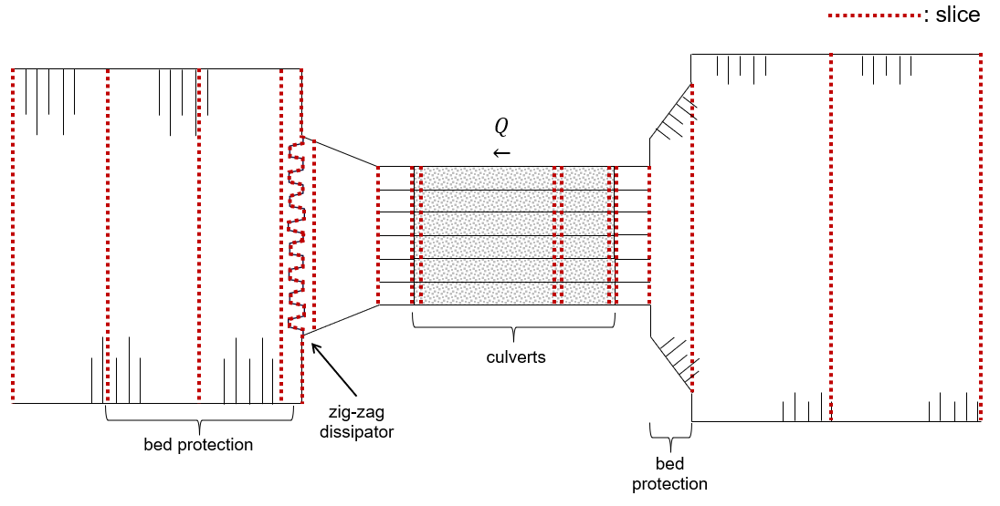

Tutorial
===========

This tutorial will guide you through the steps required to set up a SPUIS schematization and to create an input (``.in``) file. The steps to use your input file to run a SPUIS simulation are explained in the `getting started <https://spuis.readthedocs.io/en/latest/getting-started.html>`_ chapter of the documentation. 

An input file that describes the schematization of the discharge sluice consists of roughly three sections: 
1.	Boundary conditions: calculation method and a combination of discharge and downstream water level for each model run
2.	Slices: divide the discharge sluice into slices that capture changes in the lateral profile of the discharge sluice
3.	Profiles: define profiles that describe the geometry of the slices

Defining the boundary conditions
--------------------------------
SPUIS allows the use of either backwater curves (``0``) or Bernoulli and momentum equations (``1``). During the simulations, SPUIS automatically changes the direction of the calculations whenever it encounters a critical cross-section. The calculation methods are explained in more detail in the `theory <https://spuis.readthedocs.io/en/latest/theory.html>`_ chapter. Let's say we would like to use Bernoulli and momentum equations:

.. code-block:: none

   **  BOUNDARY CONDITIONS
   **
   **  Calculation method        		bm  [-]
   **  0 = method backwater curves
   **  1 = method Bernoulli/momentum equation
   **
   1

The next section of the input file requires the definition of the amount of runs (at least 1, at most 100). Each run consists of a combination of a specified downstream water level [m] and discharge [m³/s] as boundary conditions:

.. code-block:: none

   **  Number of runs               	nr  [-]
   **  Minimum 1, maximum 100.
   **
   9
   **
   **  FOR EACH RUN:
   **
   **  downstream water level         wsbe  [m]
   **  flow rate	                    qt    [m3/s]
   **
   **  Column 1	Column 2
   **  wsbe		qt
   **
    -0.10 5
    -0.15 12.5
    -0.20 22
    -0.30 29
    -0.40 32
    -0.50 34
    -0.60 35
    -0.80 45
    -1.00 48

Defining the slices
-------------------
The geometry of the discharge sluice is defined by dividing it into slices in the longitudinal direction of the sluice. All changes in the lateral profile should be captured by a slice. The entire geometry can be defined using a minimum of 2 and a maximum of 50 slices. The first entry is the number of slices used to schematize the discharge sluice. We need seventeen slices to capture the geometry of discharge sluice Bath (areas shaded in grey have a ceiling):

.. code-block:: none
   
   **  Number of slices				nx  [-]
   **
   17

Then, every slice needs to be defined by an identification number, x-location [m], bottom level [m] and profile number. The identification numbers should be in chronological order, moving from the upstream to the downstream direction. The x-location allows you to define the location of each slice along the waterway with respect to a (user-defined) reference location, and the bed level gives a reference height for the profiles that describe the geometry of the slice in-between two x-locations. A single profile may be used on multiple slices. In the next section we will define three different profiles, which all have been assigned to one or more of the slices below.

.. code-block:: none

   **  FOR EVERY SLICE:
   **
   **  slice number					id  [-]
   **  X-distance						xd  [m]
   **  Bottom level					zb  [m]
   **  Profile number					pn  [-]
   **
   **  Define slices with increasing number!
   **
   **  Column 1	Column 2	Column 3		Column 4
   **  id-number	X-distance	Bottom level	Profile number
   **  id			xd			zb				pn
   **
    1 -250.0 -7.0 1
    2 -130.0 -7.0 1
    3 -30.0 -7.0 2
    4 0.0 -6.0 3
    5 5.0 -4.25 4
    6 5.1 -5.00 5
    7 29.9 -5.00 5
    8 30.0 -5.35 13
    9 61.9 -5.35 6
    10 62.0 -6.00 7
    11 65.0 -6.00 8
    12 86.55 -6.00 14
    13 86.65 -3.50 9
    14 87.00 -8.00 10
    15 102.00 -8.00 11
    16 187.0 -8.00 12
    17 270.0 -8.00 12

Defining the profiles
---------------------
The geometry of each slice of the discharge sluice is described using a profile. A single profile can be applied to multiple slices. The first entry is the total number of profiles:

.. code-block:: none

   **  Number of profiles				np  [-]
   **
   14

Each profile follows the same structure. The first line consists of ``profile number`` ``number of y-values`` ``roughness``. This line is then followed by as many lines as indicated in ``number of y-values``. Each of these lines indicates the ``y-value`` ``width at y-value`` ``wet perimeter at y-value``. Each profile must be defined by a minimum of 2 and a maximum of 20 :math:`y`-values.

Let's first create an example profile for a canal with sloped sides. We will define the profile at three y-locations and assume that the roughness length of its sandy bed is :math:`k_{s}` = 0.01 m. The sketch below shows how the width ``W`` and wetted perimeter ``P`` (indicated in blue and orange, respectively) are defined. The first y-value of the description is always zero, as it refers to the reference bed level that was defined in the previous section.

.. image:: ../images/sketch_profile1.png

Since the width of the canal at this location varies a lot with height, the width and wetted perimeter are described at a total of 7 :math:`y`-values for this profile:

.. code-block:: none

   **
   **  profile 1: upstream canal with sandy bed
   **
 1 7 0.01
 0.00 0.00 0.00
 0.01 65.00 65.00
 1.00 73.00 73.25
 6.50 117.00 118.60 
 6.51 127.00 128.60
 7.50 133.00 134.92
 7.51 143.00 144.92
   **

The next example profile is a single square culvert. We will define the profile at four y-locations and assume that the roughness length of the smooth concrete is :math:`k_{s}` = 0.002 m. The sketch below shows how the width ``W`` and wetted perimeter ``P`` are defined in this case. Contrary to the canal with a free surface in the previous example, the final y-value of the description of the culverts has a width of zero, indicating the location of the ceiling. The wetted perimeter at this y-location is not zero, as the ceiling is now included in the total wetted perimeter. SPUIS cannot split into two or more parallel culverts. In that case, the culverts need to be schematized as a single wider culvert for the width, but for the wetted perimeter each wall needs to be taken into account in the total perimeter to ensure that the wall friction is calculated correctly by SPUIS.

.. image:: ../images/sketch_profile2.png

.. code-block:: none

   **
   **  profile 5: culverts, before gates
   **
    5 4 0.002
    0.00	0.00	0.00
    0.01	2.80	2.80
    5.50	2.80	13.8
    5.51	0.00	16.6
   **

In case of losses due to (sudden) widening or narrowing, or the presence of rebates or other irregularities, the wetted perimeter must be corrected by multiplying it with a contraction coefficient. The final example is the same as the previous example in terms of geometry, but due to the presence of rebates in the culverts we should take into account the hydraulic losses. The loss coefficient for this part of discharge sluice Bath was calculated during scale model experiments in 1982 [1]: :math:`\xi` = 0.10. This means that the contraction coefficient is equal to :math:`C_{c}` = 0.76. We must now multiply the wetted perimeter at each :math:`y`-location by 0.76:

.. image:: ../images/sketch_profile3.png

.. code-block:: none

   **
   **  profile 13: culverts near rebates and gate recess, C = 0.76
   **
    3 4 0.002
    0.00	0.00	0.00
    0.01	2.80	2.1
    5.50	2.80	10.5
    5.51	0.00	12.6
   **

Losses due to widening, narrowing or the presence of rebates or other irregularities will be highly specific to each individual structure. Some recommended sources for calculating the hydraulic losses are:
* “Internal flow systems” by D.S. Miller (1978)
* “Handbook of Hydraulic Resistance - Coefficients of Local Resistance and of Friction” by I.E. Idelchik (1960)
* “Open-Channel Hydraulics” by V.T. Chow (1985)
* “Discharge relations for hydraulic structures and head losses from different components” by P.A. Kolkman (WL | Delft Hydraulics, 1989)
* “Open-Channel Hydraulics” by R.H. French (1994)

Creating the input file
--------------------------------
The input file (``.in``) can now be created. The standard format for input files contains comments (``**``) to help the user with the set-up. A completed input file for discharge sluice Bath, that includes the examples above as profiles 1, 5 and 13, is shown here. This file can be copied and re-used to create your own schematization.

.. code-block:: none

    **###########################################################
    **Date		: 01-11-2024                                
    **Filename	: tutorial.in                                
    **Sluice	: Bathse Spuisluis                      	
    **
    **Input file for program SPUIS version 4.02, July 2024.	
    **Calculation of discharge relations of discharge sluices.
    **
    **Remark : Lines starting with '**' are for comments. 		
    **###########################################################
    **
    **
    **  BOUNDARY CONDITIONS
    **
    **  Calculation method        		bm  [-]
    **  0 = method backwater curves
    **  1 = method Bernoulli/momentum equation
    **
    1
    **
    **  Number of runs               	nr  [-]
    **  Minimum 1, maximum 100.
    **
    9
    **
    **  FOR EACH RUN:
    **
    **  downstream water level         	wsbe  [m]
    **  flow rate	                    qt    [m3/s]
    **
    **  Column 1	Column 2
    **  wsbe		qt
    **
    -0.10 5
    -0.15 12.5
    -0.20 22
    -0.30 29
    -0.40 32
    -0.50 34
    -0.60 35
    -0.80 45
    -1.00 48
    **
    **
    **  GEOMETRY OF SLUICE
    **
    **  The geometry of the sluice is defined by slices in the
    **	longitudinal direction of the sluice. The relevant slices
    **	need to be defined here.
    **
    **
    **  EXAMPLE top view of sluice:			           +++++++++++++++++++++
    **                                              +
    **  ++++++++++++++++++++++++++                  +
    **                           ++++++++++++++++++++
    **                           |||||||||
    **  |-------------------------------------------------------------------> X
    **                           |||||||||
    **                           ++++++++++++++++++++
    **  ++++++++++++++++++++++++++                  +
    **                           ^         ^      ^ +
    **   ^                    ^  |         |      | +++++++++++++++++++++
    **   |                    |  |         |      |  ^                 ^
    **   |                    |  |         |      |  |                 |
    **   |                    |  |         |      |  |                 |
    **   1  <----slices---->  2  3         4      5  6                 7
    **
    **
    **  A slice defines a change in lateral profile and a section
    **	of the sluice for which a discharge relation exists.
    **	Define number of slices minimum 2, maximum 50.
    **
    **  Number of slices				nx  [-]
    **
    17
    **
    **  FOR EVERY SLICE:
    **
    **  slice number					id  [-]
    **  X-distance						xd  [m]
    **  Bottom level					zb  [m]
    **  Profile number					pn  [-]
    **
    **  Define slices with increasing number!
    **
    **  Column 1	Column 2	Column 3		Column 4
    **  id-number	X-distance	Bottom level	Profile number
    **  id			xd			zb				pn
    **
    1 -250.0 -7.0 1
    2 -130.0 -7.0 1
    3 -30.0 -7.0 2
    4 0.0 -6.0 3
    5 5.0 -4.25 4
    6 5.1 -5.00 5
    7 29.9 -5.00 5
    8 30.0 -5.35 13
    9 61.9 -5.35 6
    10 62.0 -6.00 7
    11 65.0 -6.00 8
    12 86.55 -6.00 14
    13 86.65 -3.50 9
    14 87.00 -8.00 10
    15 102.00 -8.00 11
    16 187.0 -8.00 12
    17 270.0 -8.00 12
    **
    **
    **  FOR EVERY SLUICE SECTION:
    **
    **	A section of the sluice is the part between 2 slices.
    **	There are nx-1 sections.
    **
    **  Discharge relation				ar  [-]
    **  No longer serves a purpose as of SPUIS 4.01 - use discharge relation 0 (nx-1) times.
    **
    0 0 0 0 0 0 0 0 0 0 0 0 0 0 0 0
    **
    **
    **  DESCRIPTION PROFILES
    **
    **	The geometry of a slice is described using a profile.
    **	Define number of profiles minimum 2, maximum 20.
    **
    **  Number of profiles				np  [-]
    **
    14
    **
    **  FOR EVERY PROFILE:
    **
    **	A profile has an identification number (profile number).
    **	The number of corner points (y-values) has to be entered 
    **	for every profile. At minimum 2 and maximum 20.
    **	The roughness has to be entered for every profile, this
    **	then holds for the entire profile. The roughness is defined
    **	as a Nikuradse k-value. For every corner point a height
    **	level relative to the bottom level has to be entered (>0).
    **	For every corner point of every profile a width of the 
    **	water surface has to be entered. For every corner point the
    **	wet perimeter (for a water level at this level) has to be 
    **	entered.
    **
    **	Order for every profile:
    **	1 row with 3 number
    **		profile number				ip  [-]
    **		number of points			ny  [-]
    **		roughness					rb  [m]
    **  ny rows with 3 number
    **     level of each point			dp  [m]
    **     width at each point			bp  [m]
    **     wet perimeter at each point	op  [m]
    **
    **
    **	Enter the profile in increasing order!
    **
    **  profile 1 (upstream canal with sandy bed)
    **
     1 7 0.01
     0.00 0.00 0.00
     0.01 65.00 65.00
     1.00 73.00 73.25
     6.50 117.00 118.60 
     6.51 127.00 128.60
     7.50 133.00 134.92
     7.51 143.00 144.92
    **
    **
    **  profile 2 (bed protection in upstream canal)
    **
     2 3 0.6
     0.00 0.00 0.00 
     0.01 55.00 55.00
     7.00 111.00 122.72
    **
    **
    **  profile 3 (pillars in front of culverts, C=0.59)
    **
     3 3 0.6
     0.00 0.00 0.00 
     0.01 2.80 1.65
     6.50 2.80 9.32
    **
    **
    **  profile 4 (sill in culverts)
    **
     4 4 0.002
     0.00 0.00 0.00 
     0.01 2.80 2.80
     4.75 2.80 12.30
     4.76 0.00 15.10
    **
    **
    **  profile 5 (culverts, before gate)
    **
     5 4 0.002
     0.00 0.00 0.00 
     0.01 2.80 2.80
     5.50 2.80 13.80
     5.51 0.00 16.60
    **
    **  profile 6 (culverts, after gate)
    **
     6 4 0.002
     0.00 0.00 0.00 
     0.01 2.80 2.80
     5.85 2.80 14.50
     5.86 0.00 17.30
    **
    **  profile 7 (pillars behind culverts, C=0.65)
    **
     7 3 0.002
     0.00 0.00 0.00 
     0.01 2.80 2.80
     6.50 2.80 15.80
    **
    **  profile 8 (stilling basin, near culverts)
    **
     8 3 0.002
     0.00 0.00 0.00 
     0.01 25.00 25.00
     7.00 25.00 39.00
    **
    **  profile 9 (zigzag energy dissipator)
    **
     9 3 0.002
     0.00 0.00 0.00 
     0.01 43.52 87.04
     4.50 43.52 96.04
    **
    **  profile 10 (concrete blocks - bed protection)
    **
     10 3 0.002
     0.00 0.00 0.00 
     0.01 57.00 57.00
     11.00 145.00 147.71
    **
    **  profile 11 (riprap - bed protection)
    **
     11 3 0.6
     0.00 0.00 0.00 
     0.01 57.00 57.00
     11.00 145.00 147.71
    **
    **  profile 12 (outflow channel)
    **
     12 3 0.01
     0.00 0.00 0.00 
     0.01 57.00 57.00
     11.00 145.00 147.71
    **
    **  profile 13 (culverts near rebates and gate recess, C = 0.76)
    **
     13 4 0.002
     0.00 0.00 0.00 
     0.01 2.80 2.128
     5.85 2.80 10.49
     5.86 0.00 12.62
    **
    **  profile 14 (stilling basin, near zigzag dissipator)
    **
     14 3 0.002
     0.00 0.00 0.00 
     0.01 43.52 43.52
     7.00 43.52 57.52

Literature
-----------
* [1] WL | Delft Hydraulics (1982). ‘Lozingsmiddel Zoommeer. Verifikatie en aanpassing ontwerp, bepaling afvoerkarakteristieken en rekenmodel spuisluis met vrije waterspiegel.’ Report M1711/R1372.
