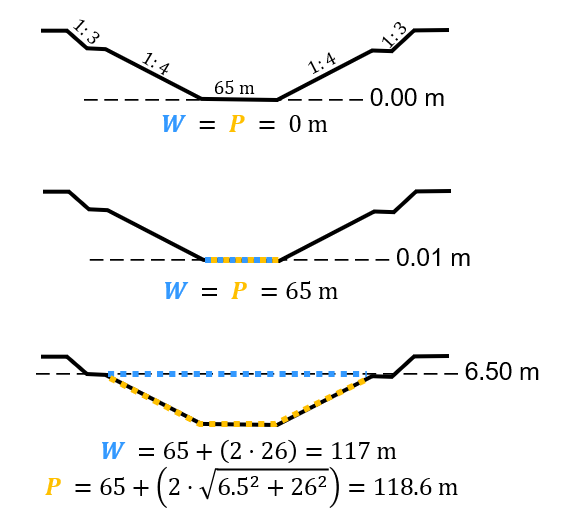
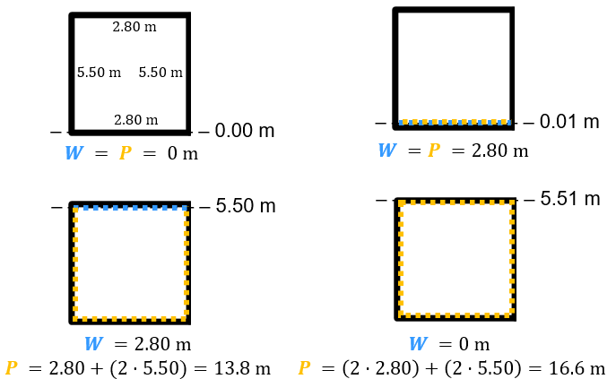
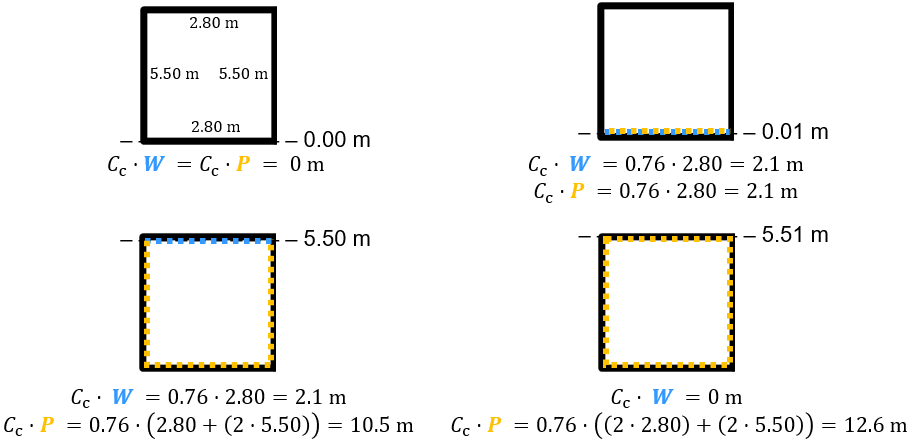

Tutorial
===========

This tutorial will guide you through the steps required to set up a SPUIS schematization and to create an input (``.in``) file. The steps to use your input file to run a SPUIS simulation are explained in the `getting started <https://spuis.readthedocs.io/en/latest/getting-started.html>`_ chapter of the documentation. 

An input file that contains the schematization of the discharge sluice consists of roughly three sections: 
1.	Boundary conditions: calculation method and a discharge and downstream water level for each model run
2.	Slices: divide the discharge sluice into slices that capture changes in the lateral profile of the discharge sluice
3.	Profiles: define profiles that describe the geometry of the slices

Defining the boundary conditions
--------------------------------
SPUIS allows the use of either backwater curves (``0``) or Bernoulli and momentum equations (``1``). During the simulations, SPUIS automatically changes the direction of the calculations whenever it encounters a critical cross-section. The calculation methods are explained in more detail in the `theory <https://spuis.readthedocs.io/en/latest/theory.html>`_ chapter. Let's say we would like to use Bernoulli and momentum equations:

.. code-block:: none

   **  BOUNDARY CONDITIONS
   **
   **  Calculation method        		bm  [-]
   **  0 = method backwater curves
   **  1 = method Bernoulli/momentum equation
   **
   1

The next section of the input file requires the definition of the amount of runs (at least 1, at most 100). Immediately afterwards, you can specify the downstream water level [m] and discharge [m³/s] for each of the runs:

.. code-block:: none

   **  Number of runs               	nr  [-]
   **  Minimum 1, maximum 100.
   **
   3
   **
   **  FOR EACH RUN:
   **
   **  downstream water level         wsbe  [m]
   **  flow rate	                    qt    [m3/s]
   **
   **  Column 1	Column 2
   **  wsbe		qt
   **
    -0.30 250.0
    -0.40 300.0
    -0.50 350.0

Defining the slices
-------------------
The geometry of the discharge sluice is defined by dividing it into slices in the longitudinal direction of the sluice. All changes in the lateral profile should be captured by a slice. The entire geometry can be defined using a minimum of 2 and a maximum of 50 slices. The first prompt is the number of slices used to schematize the discharge sluice. Let's say we need seven slices to capture the geometry of a discharge sluice:

.. code-block:: none
   
   **  Number of slices				nx  [-]
   **
   7

Then, every slice needs to be defined by an identification number, x-location [m], bottom level [m] and profile number. The identification numbers should be in chronological order, moving from the upstream to the downstream direction. The x-location allows you to define the location of each slice along the waterway with respect to a (user-defined) reference location, and the bed level gives a reference height for the profiles that describe the geometry of the slice in-between two x-locations. A single profile may be used on multiple slices. In the next section we will define three different profiles, which all have been assigned to one or more of the slices below.

.. code-block:: none

   **  FOR EVERY SLICE:
   **
   **  slice number					id  [-]
   **  X-distance						xd  [m]
   **  Bottom level					zb  [m]
   **  Profile number					pn  [-]
   **
   **  Define slices with increasing number!
   **
   **  Column 1	Column 2	Column 3		Column 4
   **  id-number	X-distance	Bottom level	Profile number
   **  id			xd			zb				pn
   **
   1   0.0 -7.0 1
   2   10.0 -7.0 1
   3   11.0 -5.0 2
   4   15.0 -5.0 3
   5   20.0 -5.0 2
   6   30.0 -7.0 1
   7   31.4 -7.0 1

Defining the profiles
---------------------
The geometry of each slice of the discharge sluice is described using a profile. The entire geometry can be defined using a minimum of 2 and a maximum of 20 profiles. A single profile can be applied to multiple slices. The first entry is the number of profiles:

.. code-block:: none

   **  Number of profiles				np  [-]
   **
   3

Each profile follows the same structure. The first line consists of ``profile number`` ``number of y-values`` ``roughness``. This line is then followed by as many lines as indicated in ``number of y-values``. Each of these lines indicates the ``y-value`` ``width at y-value`` ``wet perimeter at y-value``. 

Let's first create an example profile for a canal with sloped sides. We will define the profile at three y-locations and assume that the roughness length of its sandy bed is :math:`k_{s}` = 0.01 m. The sketch below shows how the width ``W`` and wet perimeter ``P`` (indicated in blue and orange, respectively) are defined. The first y-value of the description is always zero, as it refers to the reference bed level that was defined in the previous section.

.. code-block:: none

   **
   **  profile 1: canal
   **
    1 3 0.01
    0.00 0.00 0.00
    0.01 20.0 20.0
    4.00 52.0 52.98
   **

The next example profile is two closed-off square culverts. We will define the profile at four y-locations and assume that the roughness length of the smooth concrete is :math:`k_{s}` = 0.002 m. The sketch below shows how the width ``W`` and wet perimeter ``P`` are defined in this case. Contrary to the canal with a free surface in the previous example, the final y-value of the description of the culverts has a width of zero, indicating the location of the ceiling. The wet perimeter at this y-location is not zero, as the ceiling is now included in the total wet perimeter. SPUIS cannot split into two or more parallel culverts and these culverts are therefore schematized as a single wider culvert for the width, but for the wet perimeter each wall needs to be taken into account in the total length.

.. code-block:: none

   **
   **  profile 2: culverts
   **
    2 4 0.002
    0.00 0.00 0.00
    0.01 8.00 8.00
    4.00 8.00 24.00
    4.01 0.00 32.00
   **

In case of losses due to widening, narrowing or the presence of rebates or other irregularities, the wet perimeter must be corrected by multiplying it with a loss factor. The final example is the same as the previous example in terms of geometry, but due to the presence of rebates in a section of the culverts we should take into account the hydraulic losses. Let's say the loss factor is equal to 0.72. We must now multiply the wet perimeter at each y-location by 0.72:

.. code-block:: none

   **
   **  profile 3: rebates (c = 0.72) within culverts
   **
    3 4 0.002
    0.00 0.00 0.00
    0.01 8.00 5.76
    4.00 8.00 17.28
    4.01 0.00 23.04

Losses due to widening, narrowing or the presence of rebates or other irregularities will be highly specific to each individual structure. Some recommended sources for calculating the hydraulic losses are:
* “Internal flow systems” by D.S. Miller (1978)
* “Handbook of Hydraulic Resistance - Coefficients of Local Resistance and of Friction” by I.E. Idel'chik (1960)
* “Open-Channel Hydraulics” by V.T. Chow (1985)
* “Discharge relations for hydraulic structures and head losses from different components” by P.A. Kolkman (WL | Delft Hydraulics, 1989)
* “Open-Channel Hydraulics” by R.H. French (1994)

Creating the input file
--------------------------------
The input file (``.in``) can now be created. The standard format for input files contains comments (``**``) to help the user with the set-up. A completed input file, with the examples used above, is shown below. This file can be copied and re-used to create your own schematization.

.. code-block:: none

   **###########################################################
   **Date		  : 01-10-2024                                
   **Filename	: tutorial.in                                
   **Sluice	  : Example                      	
   **
   **Input file for program SPUIS version 4.01, March 1995.	
   **Calculation of discharge relations of discharge sluices.
   **
   **Remark : Lines starting with '**' are for comments. 		
   **###########################################################
   **
   **
   **  BOUNDARY CONDITIONS
   **
   **  Calculation method        		bm  [-]
   **  0 = method backwater curves
   **  1 = method Bernoulli/momentum equation
   **
   1
   **
   **  Number of runs              nr  [-]
   **  Minimum 1, maximum 100.
   **
   3
   **
   **  FOR EACH RUN:
   **
   **  downstream water level     wsbe  [m]
   **  flow rate	                qt    [m3/s]
   **
   **  Column 1	Column 2
   **  wsbe		qt
   **
    -0.30 250.0
    -0.40 300.0
    -0.50 350.0
   **
   **
   **  GEOMETRY OF SLUICE
   **
   ** The geometry of the sluice is defined by slices in the
   **	longitudinal direction of the sluice. The relevant slices
   **	need to be defined here.
   **
   **
   **  EXAMPLE top view of sluice:					       +++++++++++++++++++++
   **                                              +
   **  ++++++++++++++++++++++++++                  +
   **                           ++++++++++++++++++++
   **                           |||||||||
   **  |-------------------------------------------------------------------> X
   **                           |||||||||
   **                           ++++++++++++++++++++
   **  ++++++++++++++++++++++++++                  +
   **                           ^         ^      ^ +
   **   ^                    ^  |         |      | +++++++++++++++++++++
   **   |                    |  |         |      |  ^                 ^
   **   |                    |  |         |      |  |                 |
   **   |                    |  |         |      |  |                 |
   **   1  <----slices---->  2  3         4      5  6                 7
   **
   **
   ** A slice defines a change in lateral profile and a section
   **	of the sluice for which a discharge relation exists.
   **	Define number of slices minimum 2, maximum 50.
   **
   **  Number of slices				nx  [-]
   **
   7
   **
   **  FOR EVERY SLICE:
   **
   **  slice number					id  [-]
   **  X-distance						xd  [m]
   **  Bottom level					zb  [m]
   **  Profile number				pn  [-]
   **
   **  Define slices with increasing number!
   **
   **  Column 1  Column 2   Column 3      Column 4
   **  id-number X-distance	Bottom level	Profile number
   **  id			   xd			    zb				    pn
   **
   1   0.0 -7.0 1
   2   10.0 -7.0 1
   3   11.0 -5.0 2
   4   15.0 -5.0 3
   5   20.0 -5.0 2
   6   30.0 -7.0 1
   7   31.4 -7.0 1
   **
   **
   **  FOR EVERY SLUICE SECTION:
   **
   **	A section of the sluice is the part between 2 slices.
   **	There are nx-1 sections.
   **
   **  Discharge relation				ar  [-]
   **  Only use discharge relation 0 (backwater curve).
   **
   0 0 0 0 0 0
   **
   **
   **  DESCRIPTION PROFILES
   **
   **	The geometry of a slice is described using a profile.
   **	Define number of profiles minimum 2, maximum 20.
   **
   **  Number of profiles				np  [-]
   **
   3
   **
   **  FOR EVERY PROFILE:
   **
   **	A profile has an identification number (profile number).
   **	The number of corner points (y-values) has to be entered 
   **	for every profile. At minimum 2 and maximum 20.
   **	The roughness has to be entered for every profile, this
   **	then holds for the entire profile. The roughness is defined
   **	as a Nikuradse k-value. For every corner point a height
   **	level relative to the bottom level has to be entered (>0).
   **	For every corner point of every profile a width of the 
   **	water surface has to be entered. For every corner point the
   **	wet perimeter (for a water level at this level) has to be 
   **	entered.
   **
   **	Order for every profile:
   **	1 row with 3 number
   **		profile number				ip  [-]
   **		number of points			ny  [-]
   **		roughness					    rb  [m]
   **  ny rows with 3 numbers
   **     level of each point			     dp  [m]
   **     width at each point			     bp  [m]
   **     wet perimeter at each point	 op  [m]
   **
   **
   **	Enter the profile in increasing order!
   **
   **  profile 1: canal
   **
    1 3 0.01
    0.00 0.00 0.00
    0.01 20.0 20.0
    4.00 52.0 52.98
   **
   **
   **  profile 2: culverts
   **
    2 4 0.002
    0.00 0.00 0.00
    0.01 8.00 8.00
    4.00 8.00 24.00
    4.01 0.00 32.00
   **
   **
   **  profile 3: rebates (c = 0.72) within culverts
   **
    3 4 0.002
    0.00 0.00 0.00
    0.01 8.00 5.76
    4.00 8.00 17.28
    4.01 0.00 23.04
